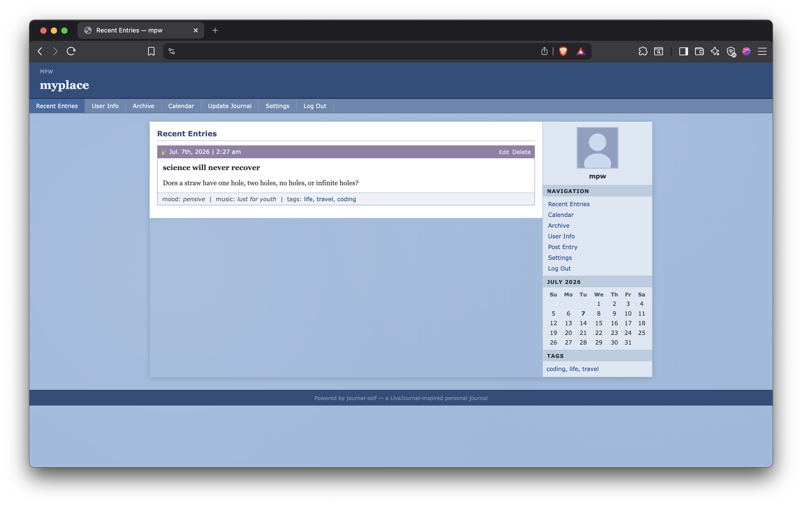

# MYPLACE Journal

A personal journaling web app built with Python/Flask and deployable for free on Fly.io. It's not MySpace... it's Livejournal.

## Features

- Classic LiveJournal "Dystopia"-inspired UI — two-column layout, blue palette, LJ-style entry cards
- Mobile-responsive: sidebar stacks below content on small screens
- Public and private entries — private entries return 404 to unauthenticated visitors
- Markdown editor with live preview (side-by-side on desktop, tab-toggle on mobile)
- Full calendar view with per-day entry listing
- Year/month archive
- Tag filtering
- Single-user auth via Flask-Login + bcrypt



---

## Local development

### 1. Clone and create a virtual environment

```bash
git clone https://github.com/yourusername/myplace-journal.git
cd myplace-journal
python -m venv .venv
source .venv/bin/activate   # Windows: .venv\Scripts\activate
pip install -r requirements.txt
```

### 2. Configure environment

```bash
cp .env.example .env
# Edit .env — set SECRET_KEY, JOURNAL_OWNER, JOURNAL_TITLE at minimum
```

### 3. Initialise the database and create your user account

```bash
flask init-db
flask create-user yourname
# You will be prompted for a password
```

### 4. Run the development server

```bash
flask run
# Visit http://127.0.0.1:5000
```

---

## Deploying to Fly.io

### Prerequisites

- [Install flyctl](https://fly.io/docs/hands-on/install-flyctl/)
- `fly auth login`

### First deploy

```bash
# Provision the app and persistent volume (SQLite lives here)
fly launch --name your-app-name --region iad --no-deploy

# Set required secrets
fly secrets set SECRET_KEY="$(python -c 'import secrets; print(secrets.token_hex(32))')"
fly secrets set JOURNAL_OWNER="yourname"
fly secrets set JOURNAL_TITLE="My Journal"

# Deploy
fly deploy

# Create your user account on the running machine
fly ssh console -C "flask create-user yourname"
```

### Subsequent deploys

```bash
fly deploy
```

### Custom domain (optional)

```bash
fly certs add yourdomain.com
# Follow the DNS instructions flyctl prints
```

---

## Environment variables

| Variable          | Default            | Description                              |
|-------------------|--------------------|------------------------------------------|
| `SECRET_KEY`      | (dev default)      | Flask session secret — **change in prod**|
| `DATABASE_URL`    | `sqlite:///journal.db` | SQLite path; Fly.io sets this to `/data/journal.db` |
| `JOURNAL_TITLE`   | `My Journal`       | Displayed in the header                  |
| `JOURNAL_OWNER`   | `journal`          | Username shown in the sidebar/header     |
| `JOURNAL_SUBTITLE`| _(empty)_          | Optional subtitle under the journal title|

---

## Tech stack

| Layer       | Technology                            |
|-------------|---------------------------------------|
| Backend     | Python 3.12 + Flask                   |
| Database    | SQLite via Flask-SQLAlchemy           |
| Auth        | Flask-Login + bcrypt                  |
| Forms       | Flask-WTF (CSRF protection)           |
| Markdown    | python-markdown + bleach              |
| Hosting     | Fly.io (free tier)                    |
| Container   | Docker (python:3.12-slim)             |
